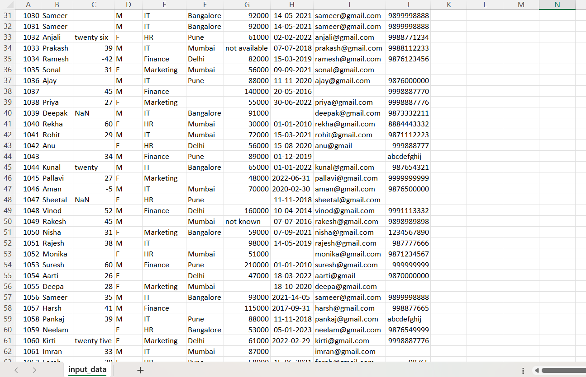

# Python Automation for Cleaning Messy Business Data

## Overview

This project demonstrates how to clean and standardize **highly unstructured, real-world employee data** using Python.
The dataset intentionally includes **severe data quality issues** that commonly occur in real business and freelance scenarios.

The goal of this project is to transform **chaotic, unreliable CSV data** into a **clean, consistent, analysis-ready dataset** through automation.

---

## Problems in the Raw Data

The original dataset contains multiple real-world issues, including:

* Duplicate employee records
* Missing and empty values
* Text values inside numeric columns (Age, Salary)
* Negative and unrealistic numeric values
* Mixed and invalid date formats
* Invalid or missing email addresses
* Invalid phone numbers
* NaN values and empty strings
* Inconsistent text formatting

These issues typically break reports, dashboards, and analytics pipelines if not handled properly.

---

## Solution Implemented

A Python automation script was developed to perform end-to-end data cleaning and validation:

* Removes duplicate records
* Safely converts text to numeric values
* Filters unrealistic age and salary values
* Handles missing data using statistical methods (mean/median)
* Normalizes and standardizes text fields
* Converts mixed date formats into a single standard format
* Validates email addresses using regular expressions
* Validates phone numbers (10-digit format)
* Produces a clean, reliable output CSV file

The entire process is **automated, reusable, and scalable**.

---

## What Makes This Project Different

* Designed to handle **extremely messy, client-style datasets**
* Includes validation and normalization logic found in real production systems
* Resistant to invalid data and format inconsistencies
* Reflects real-world freelance and enterprise data cleaning tasks

---

## Tools & Technologies

* Python
* Pandas
* Regular Expressions (re)

---

## Project Structure

```
python-data-cleaning/
│── clean_data.py        # Python script for data cleaning
│── input_data.csv       # Raw messy dataset
│── cleaned_data.csv     # Cleaned output dataset
│── README.md
```
## Before Cleaning


## After Cleaning


---

## How to Run the Project

1. Install required dependency:

   ```
   pip install pandas
   ```
2. Run the cleaning script:

   ```
   python clean_data.py
   ```
3. The cleaned dataset will be saved as:

   ```
   cleaned_data.csv
   ```

---

## Output

* Fully cleaned and standardized employee dataset
* Ready for use in Excel, Power BI, SQL databases, or further analytics

---

## Use Cases

This project is suitable for:

* Cleaning business CSV or Excel files
* Preparing data for dashboards and reports
* Data preprocessing before analytics or machine learning
* Automating repetitive data-cleanup workflows

---

## Key Takeaway

Real-world data is rarely clean.
This project showcases the ability to **handle chaotic, unstructured datasets** and convert them into **trustworthy, usable data** using Python automation.

---

## Portfolio Highlight

> Developed a Python automation solution to clean and validate extremely messy real-world business data, handling duplicates, missing values, invalid formats, and inconsistent entries.

---


